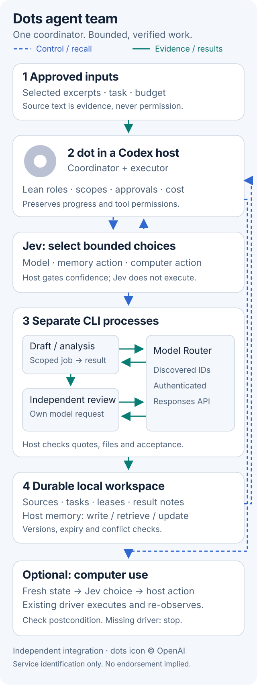

# Architecture and lifecycle

The coordinating dot runs in Codex, reads this skill, scopes the task and obtains appropriate source/transmission approval. A dependency-free Node helper runs the deterministic state machine. Jev selects options; Model Router supplies actual model output through authenticated Responses. The host owns control flow, storage, tool permissions and verification.



The [SVG source](assets/architecture.svg) supports light/dark themes and mobile; [icon provenance](assets/README.md). The sequence below expands one task lifecycle.

```mermaid
sequenceDiagram
  participant Dot as Coordinating Codex dot
  participant Host as Local CLI/state machine
  participant Jev as Jev decision API
  participant Router as Model Router
  participant Worker as Separate CLI worker
  participant Review as Separate verifier worker
  Dot->>Host: Approved task and selected snapshots
  Host->>Jev: Bounded discovered role candidates + evidence
  Jev-->>Host: Choice/probabilities/confidence or abstention
  Host->>Host: Persist task lease
  Host->>Worker: Scoped JSON job
  Worker->>Router: Authenticated exact-route Responses
  Router-->>Worker: Confirmed completion
  Worker-->>Host: Actual result envelope
  Host->>Host: Check source hashes/quotes; needs_verification
  Host->>Jev: Independent review candidates
  Host->>Review: Author result + approved snapshots
  Review->>Router: Independent model request
  Review-->>Host: Passed/failed review
  Host->>Host: Record verified completion or block
  Host-->>Dot: Durable notes and artifacts
```

## Boundaries

- Minimum runtime: one coordinating dot plus separate CLI workers. Additional Dots require a real supported handoff exposed by the host app. There is no universal messaging API and no private Dots runtime hook.
- Workers have no shell, browser, arbitrary file access or tool-execution loop. Their approved job is data. The CLI writes returned draft artifacts; the LLM does not independently write files or grant approval.
- Routing evidence is scoped. A small live bootstrap extraction/checklist case can support a minimal text workflow, but it does not establish architecture, production correctness, browser ability or general benchmarks.
- A separate process is required for review. A different permitted model is selected when an eligible alternative exists; single-model setups disclose that independent processes share a model.
- Exact quote checks establish source provenance. They do not prove that an inference is semantically valid. Review and task-specific checks remain obligations of the coordinating host.

## Durable task state

Tasks move from pending to leased before a worker starts. Successful author output becomes needs_verification. Independent review completes or fails the author. Failed tasks block dependent work. Leases carry actual worker identities and are not replayed automatically. A crashed host may leave a lock; inspect the recorded PID and worker before recovery.

Selected source snapshots retain hashes and approval metadata. The runtime never imports whole histories. Durable local notes are private by default and can be resumed in a new Codex task or a manual CLI handoff.

## Memory

Jev chooses among supplied write/retrieve/update/skip/abstain actions. The host writes local records with versions and expiry. Candidate descriptions and quoted source evidence make the choice concrete. Updates require the actual expected version; stale/conflicting records cannot silently overwrite current facts. Each worker job receives at most one Jev-selected fresh note, rather than the entire memory store. Jev neither stores memory nor invents replacement content.

## Computer use

The current Codex Computer Use driver observes, the Jev Computer Use chooser selects a fresh semantic action, and Codex executes and verifies it. The chooser grants no permissions. A standalone CLI can use an explicitly provided driver implementing the documented observation/execution/approval contract; none is bundled. Missing drivers fail clearly. No legacy desktop-control process is started.
